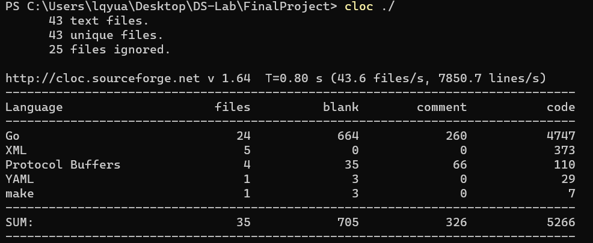
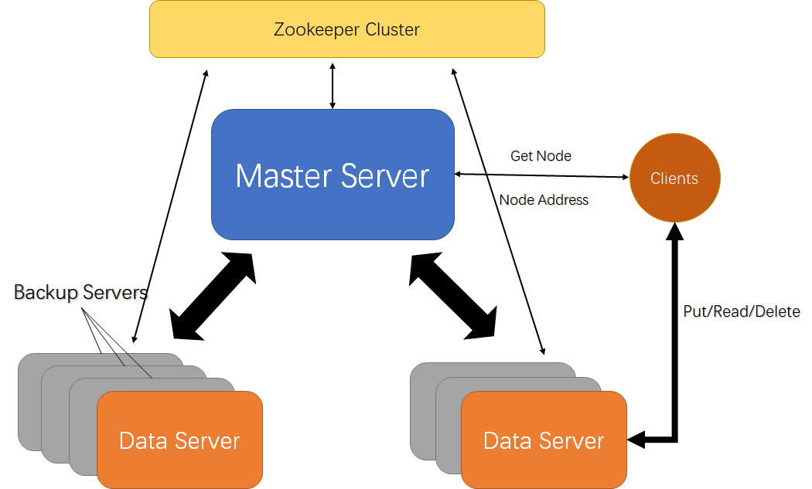

# DS-Lab5: Final Report

## 实验环境

* 操作系统：Win10

* 代码总览：

  * 编程语言以Golang为主

  * 使用的rpc库为grpc

  * 代码结构：

    ├── Client
    │  ├── Client.go
    │  └── Client_test.go
    ├── docker-compose.yml
    ├── go.mod
    ├── go.sum
    ├── lock
    │  ├── Constants.go
    │  ├── GlobalRwLock.go
    │  ├── Lock.go
    │  ├── Lock_test.go
    │  └── RwLock.go
    ├── Makefile
    ├── proto
    │  ├── ClientData
    │  │  ├── ClientData.pb.go
    │  │  └── ClientData.proto
    │  ├── ClientMaster
    │  │  ├── ClientMaster.pb.go
    │  │  └── ClientMaster.proto
    │  ├── DataData
    │  │  ├── DataData.pb.go
    │  │  └── DataData.proto
    │  └── MasterData
    │      ├── MasterData.pb.go
    │      └── MasterData.proto
    ├── Readme.md
    ├── Server
    │  ├── Data
    │  │  ├── Backup.go
    │  │  ├── Constants.go
    │  │  ├── Data.go
    │  │  └── RPC.go
    │  └── Master
    │      ├── BackupNodeManager.go
    │      ├── Constants.go
    │      ├── DataNodeManager.go
    │      ├── DataNodeManager_test.go
    │      ├── Hashring.go
    │      ├── Hashring_test.go
    │      └── Master.go
    └── utils
        └── utils.go

  * 代码规模：

    6/22修改版本，共约5300行代码。其中grpc自动生成的go文件约占2400行go代码。

    

    

## Zookeeper部署

1. 使用docker，基于` openjdk:11-jre-slim`构建zookeeper镜像。dockerfile参考官方: https://github.com/31z4/zookeeper-docker/tree/c0039669a527a56b19ceb30a6523ed206fbf245d/3.6.1
2. 使用docker-compose，运行构建好的zookeeper镜像，并部署为集群。

## 项目实现

### 架构总览

项目的大致架构如图：不同的server在本项目中使用不同的进程模拟

* Master server负责管理所有的Data Server和backup server，包括注册新的节点，记录server的端口等Metadata，对节点进行心跳检测，将backup节点升级为data节点等等
* Data server负责存储数据，以及将数据同步到各backup server。
* Backup server负责做某一个data server的备份，存储着和data server里面相同的数据。当data server故障的时候，Master server可以指定一个backup server升级为data server。
* Data server的数量和backup server的数量可以任意添加。新起的data server或者backup server会被Master发现、注册，并通过心跳检测判断它们是否存活。
* Client进行Put/Read/Delete操作的时候，首先将操作数据对象的key发到master节点，由master节点告诉client存放数据的Data节点在哪里。之后，Client直接去和Data节点进行交互，得到Put/Read/Delete的结果。

### 服务注册/心跳检测

* 本项目使用zookeeper来实现服务注册功能。
* 新的data server或者backup server创建的时候，会在zookeeper里面创建相关节点。master能够通过zookeeper感知，对其进行注册
* 服务注册：
  * 新的data节点：在Master里面添加新的data server相关的数据结构；开始监听新data节点的backup节点；开始对其进行心跳检测；将数据进行重新分片（重新分片详见"Scalability & Partition"一节）
  * 新的backup节点：在Master里面添加新的backup server相关的数据结构；开始对其进行心跳检测；通知该backup server对应的data server。将该backup server加入自己的backup server list里面；将该backup节点的数据内容与对应的data server进行同步。
  * 心跳检测：每隔数秒（本项目里面设定为2s）检查一下data server或者backup server时候存活。
* 如果data server或者backup server发生故障，将不能进行心跳检测的回应，master便得知心跳检测将会失败。
  * master在心跳检测连续失败多次（本项目里面设定为3次）后，确认server挂掉，之后master将进行相对应的操作。具体操作详见“Availability”一节

### 并发控制

* 本项目使用了zookeeper的Set/Get/Create/Delete等简单API实现了一个分布式锁，实现了`Lock()`和`Unlock()`API。
* 在自己实现的分布式锁基础上，本项目进一步通过zookeeper实现了两种粒度的分布式读写锁：一个以全局为粒度的全局读写锁，以及以data server为粒度的读写锁。
  * 该读写锁为偏向reader的读写锁。多个reader可以并发进行读操作，而writer需要在各reader操作完成之后进入进行write操作。
  * 两种锁使用zookeeper节点保存并发进行的reader数量信息。
* Client在进行Read操作时，对存放数据的对应data server加读锁。在Put和Delete的时候，对存放数据的对应的data server加写锁。
* Client在进行任何Read/Write/Delete的时候，都会首先给全局加读锁。在扩容（添加Data server的服务注册过程）的时候，Master要首先给全局加写锁，拿到写锁后再开始进行扩容，确保扩容过程和client的访问不会发生并发冲突。

### Scalability & Partition

* 本项目使用一致性哈希（hash ring）来将key分配到不同的data server节点中。同一个key只会存在于一个Data server以及该data server的backup server里面。
  * 一致性哈希算法的Hashring由Master节点来维护。每当有新的data server注册到master上时，master需要给hashring里面添加一个node。
  * Hashring可以给每个节点分配权重，一个key有更高的概率被分配到权重更高的节点中。本项目的设定暂且把所有节点的权重设成相同值。
* 当新加入data节点后，有些key所在的节点可能会发生变化。这个时候需要进行重新分片。每个data server将自己保存数据的key发送给master server，由master server判断哪些key需要重新分片到新的data server里面，并返回结果。之后，data server会将数据迁移给新的data server。所有的data server都迁移完成之后，重新分片便结束。由于一致性哈希的使用，只会有很少的数据节点需要进行数据迁移。

* 添加data server的服务注册过程会通过加锁，防止和用户请求发生并发冲突。 

### Availability

* Backup节点作为data节点的备份，和data节点的数据保持同步：

  * 新的backup节点会注册到Master，data server通过master得知该backup节点后，会进行数据同步，将自己现在的数据同步到backup节点。
  * backup节点注册后，data server收到的数据写请求（Put/Delete），会给每一个backup server发一份同样的请求以更新backup server存储的数据，同步完成后数据写请求才请求完毕。

* Data节点发生错误之后：

  * Master通过心跳检测得知data节点错误后，会检查：如果一个data节点没有backup节点，则data节点彻底崩溃，删除该data节点相关的信息；否则，Master将指定一个backup节点升级为data节点。
  * backup节点升级：backup节点通过备份恢复data节点的数据，开始监听之前data节点监听的端口提供data server的rpc服务，并且继续在之前data节点进行心跳检测的zookeeper znode上面进行心跳检测，其行为和data server完全一致。
  * backup节点崩溃：如果一个data节点还存活的时候，其对应的backup节点发生崩溃，那么Master将通过心跳检测察觉到，并直接删除掉该backup节点相关的数据结构，同时通知data节点删除掉相关的数据结构。

  * 如果在读写的过程中data节点崩溃，那么在恢复过程中的读写请求将报错，backup升级完成后恢复正常读写，不丢失数据。

### Server部署运行 

* Master Server
  * `make master`后，在build文件夹里面运行`master.exe`
* Data Server
  * `make data`后，在build文件夹里面运行`data.exe $PORT`， 如`data.exe :2200`将data server启动在2200端口（注意加冒号）。端口缺省值为`:7777`
* Backup Server
  * `make data`后，在build文件夹里面运行`data.exe $PORT`，如果端口已经被占用，则认为data server已经启动，将该节点启动为backup节点